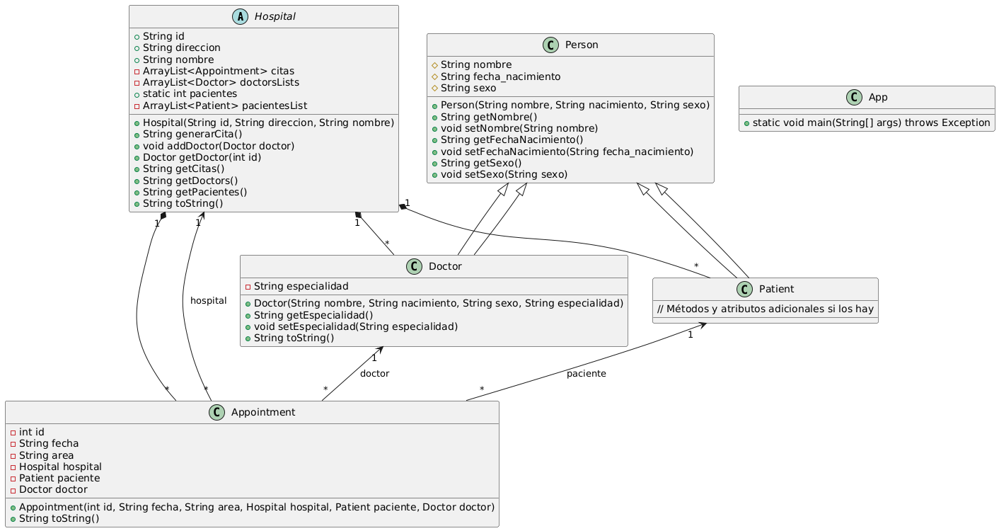

# Java_app_POO
Actividad de programación orientada a objetos, una aplicación desarrollada en Java con el paradigma de programación orientado a objetos.

Autor: @Ethan-Sarricolea

# Indice
- [Instrucciones](#instrucciones)
- [Entrega](#entrega)
- [Descripción](#descripción)
  - [Entidades](#entidades)
    - [Hospital](#hospital)
    - [Persona (Abstracta)](#person)
    - [Doctor](#doctor)
    - [Patient (Paciente)](#paciente)
    - [Appointment (cita)](#cita)
  - [Relaciones](#relaciones)
  - [Sistema](#sistema)
- [Diagrama UML](#diagrama-uml)
- [Programa](#programa)
  - [Instalación](#instalación)
  - [Ejecución](#ejecución)

# Instrucciones

Diseñar una aplicación aplicando la POO con Java de uno de los temas que se mencionan a continuación:

1. Sistema de reserva de aerolíneas/autobuses/trenes
2. Sistema de gestión de bibliotecas
3. Sistema de atención médica
4. Sistema de seguimiento de vehículos
5. Sistema de banca electrónica
6. Sistema de nómina
7. Otra (solicitar autorización del profesor)

# Entrega

- Describe la aplicación a desarrollar, incluir menú por consola. (PDF)
- Desarrollar el diagrama UML (paquetes, herencia, otras relaciones (mismo PDF anterior)
- Construye la aplicación en lenguaje de programación Java (código fuente .zip)
- Utiliza control de versiones, sube la aplicación en GitHub (enlace Github))

# Descripción

Enunciado: Se quiere realizar un sistema de atención medica, donde se gestionan los hospitales, sus areas, medicos, pacientes, citas y expedientes.

## Entidades

### Hospital
El hospital es la institución donde se realizaran las atenciones medicas, del hospital es necesario saber cuantos hospitales hay, su nombre y su identificador unico alfanumerico. De acorde al nivel del hospital tendrán diversas areas y serán las atenciones que podrá dar.

El hospital tiene una lista de pacientes, citas y doctores.

En el hospital se agendaran las citas, se agregaran los pacientes y ademas se podrán ver los listados.

### Person
Esta clase persona, será una clase abstracta acerca de las personas. en ella se registraran datos como el nombre, fecha de nacimiento y sexo, ademas de tener los metodos concretos para la obtencion de estos mismos datos y su modificacion (Setters y getters).

### Doctor

Los medicos son una extension de la clase abstracta persona, ya que tienen todos sus datos de identificacion personal y metodos de edicion de estos. Ademas de ello los medicos / doctores tienen un atributo especialidad, que determina en que zona se especializan (ya sea laboratorio, enfermeria, cirugia, etc.).

### Paciente
Los pacientes igualmente se extienden de la clase persona, por lo que se identifican por nombre, fecha de nacimiento y sexo, además tienen un atributo "hasExpediente" que determina si tienen o no un expediente.

### Cita

Los medicos atendrán a los pacientes en las citas, cada cita se registra en el sistema y contiene un identificador unico, la fecha de agenda, el hospital, el area y nombre de paciente.

## Relaciones
- Los medicos y pacientes son personas
- El hospital necesita medicos que trabajen en el
- El hospital puede agendar citas
- Una cita requiere de un paciente

## Sistema

El sistema permite ver la información del hospital, el listado de empleados y el listado de clientes.
1. El sistema debe mostrar el menu de opciones para ver la informacion del hospital, ver informacion sobre los empleados, de los pacientes, de las citas o cerrar el sistema.
2. El sistema debe permitir ver y registrar doctores / personal que trabaje en el hospital
3. El sistema debe permitir ver la informacion del hospital, incluido el conteo que lleva de pacientes
4. El sistema debe permitir ver la lista de pacientes registrados en alguna cita
5. El sistema debe permitir agendar una cita con un paciente, doctor y fecha y/o ver las citas agendadas

# Diagrama UML

## Instalación

Para descargar el repositorio se puede hacer mediante el siguiente comando:

    git clone https://github.com/Ethan-Sarricolea/Java_app_POO.git

## Ejecución

Una vez descargado el comando es necesario desplazarse a la ruta del proyecto por medio del comando `cd Java_app_POO`.

Una vez la terminal apunte a la ruta mencionada del repositorio clonado, se puede ejecutar la aplicaón con el siguiente comando:

    javac src\App.java

## Estructura de carpetas

El espacio de trabajo contiene dos carpetas de forma predeterminada, donde:

- `src`: la carpeta para mantener las fuentes
- `lib`: la carpeta para mantener las dependencias

Mientras tanto, los archivos de salida compilados se generarán en la carpeta `bin` de forma predeterminada.

> Si desea personalizar la estructura de carpetas, abra `.vscode/settings.json` y actualice la configuración relacionada allí.

## Administración de dependencias

La vista `PROYECTOS JAVA` le permite administrar sus dependencias. Puede encontrar más detalles [aquí](https://github.com/microsoft/vscode-java-dependency#manage-dependencies).